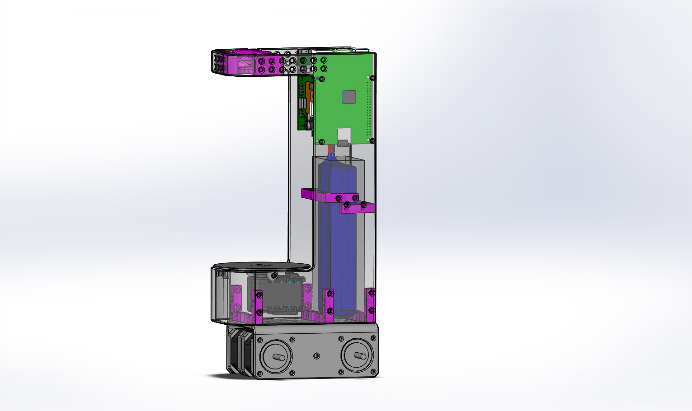

# BigBoy

Software created to drive le smallest robot that I build for the national Robotic Cup in France.

## Hardware:

BigBoy is based on Mecanum wheel and powered by Raspberry Pi

## Features:

 - [ ] Holonomic moves
 - [ ] Draw picture 
 - [ ] MQTT
 - [ ] Display